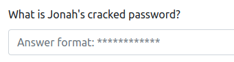
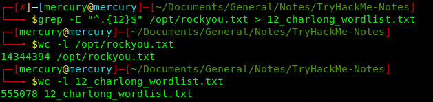

# TryHackMe Notes

### Password Cracking/Brute Force

This is one of the more laborious aspects of TryHackMe, as many rooms incorporate some form of brute force/password cracking.
Generally, the policy is that passwords should be near the start of the `rockyou.txt` password list, and if not, it is "not crackable"

However, I've encountered many machines where this is not the case.

TryHackMe is great, as the answers to questions have the length of the answer denoted by `*`, as show below:


This allows us to shorten rockyou.txt immensely, and only attempt passwords of the said length (in this example: 12 characters long)

```sh
grep -E "^.{11}$" /opt/rockyou.txt
```



We can see in the above screenshot, `rockyou.txt` has been made over 25x smaller!

While the above regex might look intimidating, we can break it down into smaller bits.

`grep -E` : Tells grep to use "extended regex"
`^` : Matches the start of the line
`.{12}` : The `.` matches any character, and the `{12}` simply tells grep to find 12 of 'em
`$` : Matches the end of the line
