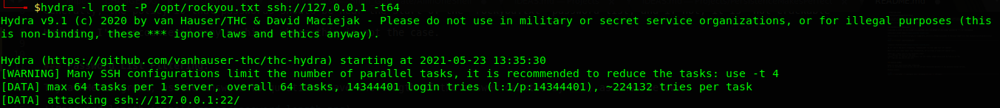

# TryHackMe Notes

## Password Cracking/Brute Force

This is one of the more laborious aspects of TryHackMe, as many rooms incorporate some form of brute force/password cracking.
Generally, the policy is that passwords should be near the start of the `rockyou.txt` password list, and if not, it is "not crackable"

However, I've encountered many machines where this is not the case.  
  

### Password List Filtering:

TryHackMe is great, as the answers to questions have the length of the answer denoted by `*`, as show below:  


This allows us to shorten rockyou.txt immensely, and only attempt passwords of the said length (in this example: 12 characters long)  

```sh
grep -E "^.{11}$" /opt/rockyou.txt
```


We can see in the above screenshot, `rockyou.txt` has been made over 25x smaller!

While the above regex might look intimidating, we can break it down into smaller bits.

`grep -E` : Tells grep to use "extended regex"  
`^` : Matches the start of the line  
`.{12}` : The `.` matches any character, and the `{12}` simply tells grep to find 12 of 'em  
`$` : Matches the end of the line
  

### General Hydra:

Hydra is your best friend with TryHackMe.  
It is so incredibly easy to use, and can operate relatively quickly if you allocate enough threads.

General syntax:

```sh
hydra -l [username] -P [password_list] [protocol]://[ip] -t [threads]
```

For example:  
  

  
On the topic of threads, you'll get many a warning notice when you try to run hydra/anything really on a high number of threads. 
This is because it is much more aggressive and detectable, and if you go too hard, the service can crash.  

So please never, ever do this against a live target.
However, on TryHackMe, you have a dedicated instance so the stakes aren't *quite* as high.  
  
Yes, the more aggressively you attack a service using tools, the higher the chances of false positives or negatives.  

**But**, if you're playing to try and get blood on a machine, or are simply impatient, I've found threads do massively save your time.


### Attacking HTTP Post Forms:

[yeah I need to do this]